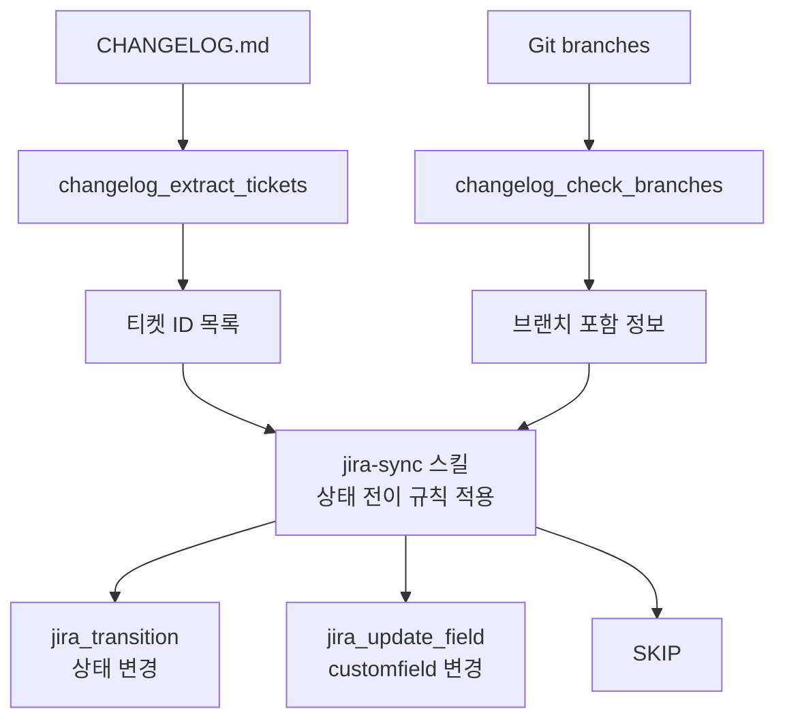
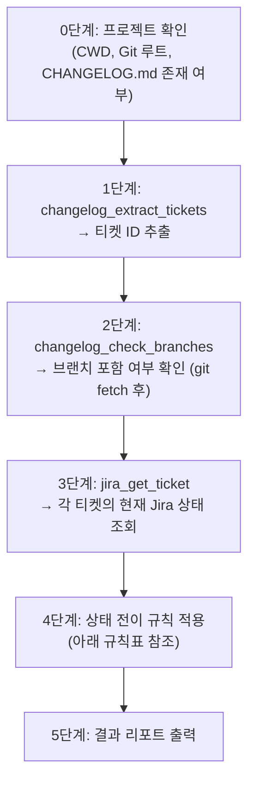

# Jira MCP Server

CHANGELOG.md 기반 Jira 티켓 상태 자동 동기화를 위한 MCP(Model Context Protocol) 서버입니다.

## 목적

개발팀의 Git 브랜치 배포 흐름(main -> staging -> production)에 맞춰 Jira 티켓 상태를 자동으로 업데이트합니다. CHANGELOG.md에 기록된 티켓 ID를 기반으로 각 브랜치 포함 여부를 확인하고, 규칙에 따라 Jira 상태를 전이합니다.

### 해결하는 문제

- 수동으로 Jira 티켓 상태를 변경하는 반복 작업 제거
- CHANGELOG.md와 Jira 상태 간의 불일치 해소
- staging 배포 여부 커스텀 필드(`customfield_10659`) 자동 관리

## 아키텍처



**구성 요소:**

| 구성 요소 | 역할 |
|-----------|------|
| MCP Server (`mcp-servers/jira/`) | Jira REST API + Git CLI 래핑, 11개 도구 제공 |
| Skill (`skills/jira-sync/`) | 상태 전이 규칙 정의 (Claude가 참조) |
| Command (`commands/sync-jira-tickets.md`) | `/sync-jira-tickets` 커맨드 오케스트레이션 절차 |

## 기술 스택

- **런타임**: Node.js + [tsx](https://github.com/privatenumber/tsx) (TypeScript 직접 실행)
- **MCP SDK**: `@modelcontextprotocol/sdk@^1.27.0`
  - `McpServer`: `@modelcontextprotocol/sdk/server/mcp.js`
  - `StdioServerTransport`: `@modelcontextprotocol/sdk/server/stdio.js`
- **스키마 검증**: `zod@^3.25.0`
- **API**: Jira REST API v3 (직접 fetch), Jira Agile API v1.0
- **Git**: `child_process.execSync`로 Git CLI 호출

## 설치 및 설정

### 1. 사전 요구사항

- Node.js 18+ 및 npm
- Jira API Token ([발급 페이지](https://id.atlassian.com/manage-profile/security/api-tokens))
- datamaker-kr organization 멤버십

### 2. 의존성 설치

```bash
cd plugins/platform-dev-team-common/mcp-servers/jira
npm install
```

### 3. Claude Code에 MCP 서버 등록

`~/.claude/settings.json`에 다음을 추가합니다:

```jsonc
{
  "mcpServers": {
    "jira": {
      "command": "npx",
      "args": ["tsx", "<plugin-path>/mcp-servers/jira/src/index.ts"],
      "env": {
        "JIRA_API_TOKEN": "발급받은_API_토큰",
        "JIRA_USER_EMAIL": "your@datamaker.io",
        "JIRA_BASE_URL": "https://datamaker.atlassian.net"
      }
    }
  }
}
```

> `<plugin-path>`는 플러그인이 설치된 절대 경로로 대체합니다.
> 예: `~/.claude/plugins/platform-dev-team-common`

### 4. Claude Code 재시작

설정 후 Claude Code를 재시작하면 MCP 서버가 자동으로 시작됩니다.

### 5. 연결 확인

```bash
# Claude Code 내에서
/mcp
```

`jira` 서버가 목록에 나타나면 정상입니다.

## 사용법

### /sync-jira-tickets 커맨드

CHANGELOG.md의 Jira 티켓들을 Git 브랜치 상태에 맞게 일괄 동기화합니다.

```bash
/sync-jira-tickets                          # unreleased 섹션 동기화 (기본)
/sync-jira-tickets --section unreleased     # 명시적으로 unreleased 섹션 지정
/sync-jira-tickets --section v2026.1.1      # 특정 릴리스 섹션만 동기화
/sync-jira-tickets --dry-run                # 변경 사항 미리보기 (실제 변경 없음)
```

#### 적용 대상 프로젝트

각 프로젝트 디렉토리에서 개별적으로 실행해야 합니다:

- synapse-workspace
- synapse-backend
- synapse-annotator
- synapse-sdk
- synapse-agent

#### 실행 흐름



#### 상태 전이 규칙

Git 브랜치 배포 흐름: **main -> staging -> production**

| # | 조건 | 액션 |
|---|------|------|
| 1 | main/staging에 있고 상태가 리뷰 완료 미만 | `jira_transition` -> "리뷰 완료" |
| 2 | staging 또는 production에 있고 customfield_10659 미설정 | `jira_update_field(customfield_10659, {id: "10678"})` |
| 3 | staging에 있고 현재 상태가 "검토 완료" | SKIP (QA 확인된 상태 유지) |
| 4 | production에 있고 현재 상태가 "완료"가 아님 | `jira_transition` -> "완료" |

> **규칙 2 참고**: production에 있는 티켓도 staging을 거쳐 배포되므로 staging 배포 여부 필드를 함께 설정합니다.

#### Jira 상태 체계


| 상태 | 의미 |
|------|------|
| 대기 | 미착수 또는 로컬 작업 중 |
| 진행 중 | 원격 Git에 올라갔으나 PR 없음 |
| 리뷰 중 | PR이 생성된 상태 |
| 리뷰 완료 | PR Approve 후 main 브랜치에 병합 완료 |
| 검토 완료 | QA 담당자가 staging에서 확인 완료 |
| 완료 | Production 브랜치에 병합 |

#### 결과 리포트 예시

```
## Jira 동기화 결과

프로젝트: synapse-workspace (/Users/.../synapse-workspace)
섹션: unreleased

| 티켓 | 이전 상태 | 액션 | 결과 |
|------|----------|------|------|
| SYN-1234 | 리뷰 중 | -> 리뷰 완료 | 완료 |
| SYN-5678 | 완료 | customfield 변경 | 완료 |
| SYN-9012 | 검토 완료 | SKIP | - |
| SYN-3456 | 리뷰 완료 | -> 완료 | 완료 |

처리: 3건 / 스킵: 1건 / 실패: 0건
```

### 개별 도구 사용

MCP 서버가 제공하는 도구들은 `/sync-jira-tickets` 외에도 Claude와의 대화에서 직접 사용할 수 있습니다.

#### 티켓 관련

| 도구 | 설명 | 주요 파라미터 |
|------|------|-------------|
| `jira_get_ticket` | 티켓 상세 조회 | `ticketId`, `fields[]` |
| `jira_search_tickets` | JQL로 티켓 검색 | `jql`, `maxResults` |
| `jira_create_ticket` | 새 티켓 생성 | `projectKey`, `summary`, `issueType` |
| `jira_update_ticket` | 티켓 필드 수정 | `ticketId`, `fields` |

#### 상태 전이

| 도구 | 설명 | 주요 파라미터 |
|------|------|-------------|
| `jira_list_transitions` | 가능한 전이 목록 조회 | `ticketId` |
| `jira_transition` | 상태 전이 실행 | `ticketId`, `targetStatus` |

#### 커스텀 필드

| 도구 | 설명 | 주요 파라미터 |
|------|------|-------------|
| `jira_update_field` | 커스텀 필드 값 변경 | `ticketId`, `fieldId`, `value` |

#### 보드/스프린트

| 도구 | 설명 | 주요 파라미터 |
|------|------|-------------|
| `jira_get_board` | 보드 정보 조회 | `boardId` |
| `jira_get_sprint` | 활성 스프린트 조회 | `boardId` 또는 `sprintId` |

#### CHANGELOG 유틸리티

| 도구 | 설명 | 주요 파라미터 |
|------|------|-------------|
| `changelog_extract_tickets` | CHANGELOG.md에서 티켓 ID 추출 | `filePath`, `section` |
| `changelog_check_branches` | 티켓별 브랜치 포함 여부 확인 | `ticketIds[]`, `branches[]`, `cwd` |

#### 사용 예시

```
# 특정 티켓 상태 확인
"SYN-1234 티켓 상태 확인해줘"

# JQL로 내 담당 티켓 검색
"내가 담당인 진행 중인 티켓 목록 보여줘"

# 현재 스프린트 확인
"보드 123의 활성 스프린트 보여줘"
```

## 프로젝트 구조

```
mcp-servers/jira/
├── src/
│   ├── index.ts              # 서버 엔트리포인트 (도구 등록 + stdio 연결)
│   ├── jira-client.ts        # Jira REST API 클라이언트 (fetch 래퍼)
│   └── tools/
│       ├── ticket.ts         # 티켓 CRUD 도구 (4개)
│       ├── transition.ts     # 상태 전이 도구 (2개)
│       ├── field.ts          # 커스텀 필드 도구 (1개)
│       ├── board.ts          # 보드/스프린트 도구 (2개)
│       └── changelog.ts      # CHANGELOG 파싱 + Git 브랜치 비교 도구 (2개)
├── package.json
├── tsconfig.json
├── .gitignore
└── README.md                 # 이 파일
```

**관련 파일:**

```
skills/jira-sync/SKILL.md     # 상태 전이 규칙 정의 (Claude가 참조)
commands/sync-jira-tickets.md         # /sync-jira-tickets 커맨드 오케스트레이션 절차
```

## 환경 변수

| 변수 | 필수 | 설명 | 예시 |
|------|------|------|------|
| `JIRA_BASE_URL` | O | Jira 인스턴스 URL | `https://datamaker.atlassian.net` |
| `JIRA_USER_EMAIL` | O | Jira 계정 이메일 | `your@datamaker.io` |
| `JIRA_API_TOKEN` | O | Jira API 토큰 | `ATATxxxxxxx...` |

## Custom Field 참고

| 필드 ID | 용도 | 타입 | 값 |
|---------|------|------|-----|
| `customfield_10659` | Staging 배포 여부 | select | `{id: "10678"}` = "Staging 배포" |

## 문제 해결

### MCP 서버가 시작되지 않음

```bash
# 직접 실행하여 에러 확인
cd plugins/platform-dev-team-common/mcp-servers/jira
npx tsx src/index.ts
```

- 환경 변수 누락 -> `JIRA_BASE_URL`, `JIRA_USER_EMAIL`, `JIRA_API_TOKEN` 설정 확인
- 의존성 미설치 -> `npm install` 실행
- Node.js 버전 -> 18 이상 필요

### 티켓 상태 전이 실패

- `jira_list_transitions`로 해당 티켓에서 가능한 전이 목록 확인
- Jira 워크플로우에서 직접 전이가 허용되지 않을 수 있음 (중간 단계 필요)
- 티켓 상태가 "취소"인 경우 전이 규칙을 건너뜁니다

### CHANGELOG에서 티켓이 추출되지 않음

CHANGELOG.md의 티켓 항목은 다음 형식이어야 합니다:

```markdown
- [SYN-1234](https://jira.example.com/browse/SYN-1234) 티켓 설명
```

### 브랜치 확인이 정확하지 않음

- `changelog_check_branches`는 `git log --grep`으로 커밋 메시지에서 티켓 ID를 검색합니다
- 커밋 메시지에 티켓 ID가 포함되어 있어야 합니다
- `git fetch --all`이 실행 전 자동으로 수행됩니다

## 변경 이력

- **v1.0.0** (2026-03-05): 초기 구현
  - Jira REST API 클라이언트
  - 11개 MCP 도구 (티켓, 전이, 필드, 보드, CHANGELOG)
  - jira-sync 스킬 및 /sync-jira-tickets 커맨드
  - staging/production 배포 여부에 따른 customfield 자동 설정
