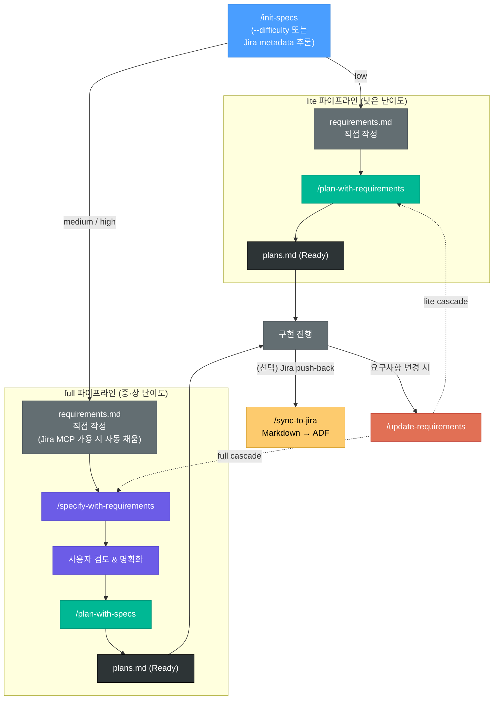

# SDD Helper

Claude Code용 경량 Spec-Driven Development(SDD) 워크플로우 플러그인입니다.
요구사항 작성부터 기술 명세 생성, 구현 계획 수립, Jira push-back까지 전체 라이프사이클을 6개의 스킬로 관리합니다.

**v1.1.0 주요 변경**:
- **난이도 기반 파이프라인 분기**: `low` 난이도는 `requirements → plans` *lite* 흐름으로, `medium`/`high`는 기존 *full* 흐름으로 분기.
- **Jira MCP 연동 (선택)**: `/init-specs`가 Jira 티켓에서 requirements 초안을 자동 작성하고, 새 `/sync-to-jira` 스킬이 완성된 specs/plans를 Jira description으로 push-back (Markdown → ADF 자동 변환).

## SDD란?

**Spec-Driven Development(명세 기반 개발)**는 코드를 작성하기 전에 요구사항과 기술 명세를 먼저 정의하는 개발 방법론입니다.

**왜 SDD를 도입해야 하나요?**

- **명확한 방향** — 무엇을 만들어야 하는지 코딩 전에 확정합니다
- **추적 가능성** — 요구사항(FR-X) → 기술 명세(TS-X) → 구현 단계(Step N)로 이어지는 연쇄 추적이 가능합니다
- **변경 관리** — 요구사항이 변경되면 명세와 계획이 자동으로 연쇄 업데이트됩니다
- **리뷰 게이트** — 각 단계에서 사용자가 검토하고 확인한 후 다음 단계로 진행합니다

## 빠른 시작

```bash
# 1. 플러그인 설치
/plugin install sdd-helper@synapse-marketplace

# 2. 스펙 문서 초기화 (Git 브랜치도 자동 생성)
/init-specs SYN-1234 사용자 인증 기능

# 3. specs/사용자-인증-기능/requirements.md에 요구사항 직접 작성

# 4. 요구사항에서 기술 명세 자동 생성
/specify-with-requirements 사용자-인증-기능

# 5. 명세에서 구현 계획 자동 생성
/plan-with-specs 사용자-인증-기능
```

## 워크플로우 다이어그램

난이도에 따라 두 가지 파이프라인으로 분기합니다.


```mermaid
graph TB
    A["/init-specs<br/>(--difficulty 또는<br/>Jira metadata 추론)"]

    A -- "low" --> B1["requirements.md<br/>직접 작성"]
    A -- "medium / high" --> B2["requirements.md<br/>직접 작성<br/>(Jira MCP 가용 시 자동 채움)"]

    subgraph lite["lite 파이프라인 (낮은 난이도)"]
        B1 --> P1["/plan-with-requirements"]
        P1 --> R1["plans.md (Ready)"]
    end

    subgraph full["full 파이프라인 (중·상 난이도)"]
        B2 --> C["/specify-with-requirements"]
        C --> D["사용자 검토 & 명확화"]
        D --> E["/plan-with-specs"]
        E --> R2["plans.md (Ready)"]
    end

    R1 --> G["구현 진행"]
    R2 --> G
    G -- "요구사항 변경 시" --> F["/update-requirements"]
    F -. "lite cascade" .-> P1
    F -. "full cascade" .-> C
    G -- "(선택) Jira push-back" --> S["/sync-to-jira<br/>Markdown → ADF"]

    style A fill:#4a9eff,stroke:#2d7cd6,color:#fff
    style B1 fill:#636e72,stroke:#4a5459,color:#fff
    style B2 fill:#636e72,stroke:#4a5459,color:#fff
    style C fill:#6c5ce7,stroke:#5a4bd1,color:#fff
    style D fill:#6c5ce7,stroke:#5a4bd1,color:#fff
    style E fill:#00b894,stroke:#00967a,color:#fff
    style P1 fill:#00b894,stroke:#00967a,color:#fff
    style R1 fill:#2d3436,stroke:#000,color:#fff
    style R2 fill:#2d3436,stroke:#000,color:#fff
    style F fill:#e17055,stroke:#c0392b,color:#fff
    style G fill:#636e72,stroke:#4a5459,color:#fff
    style S fill:#fdcb6e,stroke:#d4a233,color:#000
```

핵심 원칙: **사용자가 요구사항을 직접 작성**(또는 Jira에서 자동 채움)하고, AI가 기술 명세와 구현 계획을 생성하며, 필요 시 결과를 Jira로 다시 push-back 합니다.

## 스킬 레퍼런스

스킬은 슬래시 커맨드(`/스킬명`)로 직접 호출하거나, 트리거 키워드로 자동 활성화됩니다.

| 스킬 | 설명 | 트리거 키워드 | 사용 예시 |
|------|------|-------------|----------|
| `/init-specs` | 스펙 문서 초기화 + Git 브랜치 생성. 난이도/파이프라인 분기, Jira 자동 채움 | "init specs", "새 태스크", "스펙 초기화" | `/init-specs SYN-1234 사용자 인증 기능 --difficulty medium` |
| `/specify-with-requirements` | 요구사항 → 기술 명세 자동 생성 (full). lite→full 승격도 처리 | "specify", "기술 명세", "요구사항 분석", "escalate" | `/specify-with-requirements 사용자-인증-기능` |
| `/plan-with-specs` | 명세 → 구현 계획 자동 생성 (full 파이프라인) | "plan", "구현 계획", "계획 생성" | `/plan-with-specs 사용자-인증-기능` |
| `/plan-with-requirements` | 요구사항 → 구현 계획 직행 (lite 파이프라인) | "lite plan", "간단한 계획" | `/plan-with-requirements 작은-버그-수정` |
| `/update-requirements` | 요구사항 변경 및 연쇄 업데이트 (lite/full 모드 자동 인식) | "update requirements", "요구사항 변경" | `/update-requirements TOTP 2단계 인증 추가` |
| `/sync-to-jira` | 완성된 specs/plans를 Jira description으로 push-back (Markdown → ADF) | "sync to jira", "jira 업데이트", "ADF" | `/sync-to-jira 사용자-인증-기능 --target both` |

## 에이전트 레퍼런스

에이전트는 스킬을 조율하여 전체 워크플로우를 오케스트레이션합니다.

| 에이전트 | 목적 |
|----------|------|
| spec-manager | SDD 전체 라이프사이클 오케스트레이션: init → specify → plan → update |

spec-manager 에이전트는 `user-invocable: false`로 설정되어 있으며, 대화 컨텍스트에 따라 자동으로 활성화됩니다. SDD 관련 질문이나 워크플로우 안내가 필요할 때 배경에서 동작합니다.

## 생성되는 산출물

모든 SDD 산출물은 프로젝트 루트의 `specs/` 디렉토리에 저장됩니다.

**full 파이프라인** (medium / high 난이도):

```
<project-root>/
└── specs/
    └── <task-slug>/
        ├── requirements.md             # 사용자가 직접 작성 (또는 Jira 자동 채움)
        ├── specs.md                    # AI가 생성하는 기술 명세
        └── plans.md                    # AI가 생성하는 구현 계획
```

**lite 파이프라인** (low 난이도): `specs.md`는 생성되지 않습니다.

```
<project-root>/
└── specs/
    └── <task-slug>/
        ├── requirements.md
        └── plans.md
```

`requirements.md` 헤더에는 다음 필드가 포함됩니다:

| Field | 값 | 역할 |
|-------|---|------|
| `Difficulty` | `low` / `medium` / `high` | 파이프라인 분기 결정 |
| `Pipeline` | `lite` / `full` | 다른 스킬이 동작 모드를 결정할 때 참조 |
| `Source` | `manual` / `jira:<ticket-id>` | 요구사항 출처 추적 |

### 문서 간 추적 가능성

```
FR-1 (Functional Requirement)  →  TS-1 (Technical Spec)  →  Step 1 (Implementation)
FR-2                           →  TS-2                    →  Step 2
FR-3                           →  TS-3                    →  Step 3, Step 4
```

### 문서 상태 흐름

| 문서 | 파이프라인 | 상태 흐름 |
|------|-----------|----------|
| requirements.md | both | `Draft` / `Draft (from Jira)` → `Final` |
| specs.md | full only | `Pending` → `Draft` → `Final` |
| plans.md | both | `Pending` → `Ready` → `In Progress` → `Completed`. lite→full 승격 후에는 `Stale (specs added)` 단계가 추가될 수 있음. |

## 상세 사용 예시

### 예시 A: 새 기능 전체 워크플로우

```bash
# Step 1: 스펙 문서 초기화
/init-specs SYN-1234 사용자 인증 기능

# Claude가 생성:
#   Branch: syn-1234-사용자-인증-기능
#   specs/사용자-인증-기능/requirements.md  ← 여기에 요구사항 작성
#   specs/사용자-인증-기능/specs.md         ← Pending 상태
#   specs/사용자-인증-기능/plans.md         ← Pending 상태

# Step 2: 사용자가 requirements.md에 요구사항 직접 작성
# (FR-1: 이메일/비밀번호 로그인, FR-2: OAuth2 소셜 로그인, ...)

# Step 3: 기술 명세 생성
/specify-with-requirements 사용자-인증-기능

# Claude가 요구사항을 분석하여 specs.md 업데이트:
#   TS-1: 인증 미들웨어 구성 (from FR-1)
#   TS-2: User 모델 확장 (from FR-1, FR-2)
#   TS-3: OAuth2 프로바이더 통합 (from FR-2)
#   ...
# 모호한 부분은 질문하여 명확화

# Step 4: 구현 계획 생성
/plan-with-specs 사용자-인증-기능

# Claude가 명세를 분석하여 plans.md 업데이트:
#   Step 1: 인증 설정 파일 생성 (Simple, TS-1)
#   Step 2: User 모델 확장 (Medium, TS-2)
#   Step 3: 로그인 서비스 구현 (Medium, TS-1)
#   Step 4: OAuth2 콜백 핸들러 구현 (Complex, TS-3)
#   ...

# Step 5: 계획에 따라 구현 진행
```

### 예시 B: 요구사항 변경

```bash
# 요구사항 변경
/update-requirements 2단계 인증(TOTP) 요구사항 추가

# Claude가:
#   1. requirements.md에 FR-4: TOTP 기반 2단계 인증 추가
#   2. specs.md에 TS-4: TOTP 구현 명세 추가 (lite 파이프라인이면 건너뜀)
#   3. plans.md에 Step 5: TOTP 미들웨어 구현 추가
#   4. 기존 완료된 단계는 보존
```

### 예시 B-2: lite 파이프라인 — 작은 버그 수정

```bash
# 낮은 난이도로 초기화 (specs.md 생성 안 됨)
/init-specs SYN-9999 로그인 페이지 오타 수정 --difficulty low

# requirements.md만 채워서 plan으로 직행
/plan-with-requirements 로그인-페이지-오타-수정

# Claude가:
#   - plans.md에 구현 계획 작성 (FR-X 직접 참조, TS-X 없음)
#   - Status: Ready
```

### 예시 B-3: lite → full 승격

```bash
# lite로 시작했지만 작업이 커지자 full로 전환
/specify-with-requirements 로그인-페이지-오타-수정

# Claude가:
#   1. 승격 확인 (AskUserQuestion)
#   2. requirements.md 헤더를 Pipeline: full 로 갱신
#   3. specs.md 신규 생성
#   4. 기존 plans.md는 "Stale (specs added)"로 마킹 → /plan-with-specs 재실행 필요
```

### 예시 C: Jira MCP 자동 채움 + push-back

Jira MCP가 환경에 설치되어 있고 `JIRA_*` 환경변수가 설정된 경우에만 사용 가능합니다.

```bash
# Jira 티켓에서 requirements.md 초안 자동 생성
/init-specs SYN-1234 사용자 인증 기능

# Claude가:
#   - Jira MCP의 jira_get_ticket 호출
#   - summary → Overview, description의 Acceptance Criteria → FR-N 매핑
#   - priority/labels로 난이도 추론 (--difficulty 명시되지 않은 경우)
#   - requirements.md 헤더: Status: Draft (from Jira), Source: jira:SYN-1234

# 사용자가 검토 후 다음 단계 진행
/specify-with-requirements 사용자-인증-기능
/plan-with-specs 사용자-인증-기능

# 완성된 문서를 Jira description으로 push-back
/sync-to-jira 사용자-인증-기능 --target both

# Claude가:
#   1. Jira MCP 가용성 확인
#   2. specs.md + plans.md를 단일 markdown payload로 결합
#   3. 현재 Jira description과 diff 표시
#   4. 사용자 Apply 확인 후 Markdown → ADF 변환하여 PUT
#   5. description의 <!-- sdd:start --> ~ <!-- sdd:end --> 구간만 교체
#   6. Jira 이슈 링크 출력
```

### 예시 C: 처음 사용하는 경우

```bash
# 사용자가 "SDD가 뭐야?" 또는 "스펙 관리 어떻게 해?" 같이 질문하면
# spec-manager 에이전트가 자동 활성화되어 안내:
#
#   SDD Helper — Spec-Driven Development 도우미
#
#   SDD란? 요구사항 → 기술 명세 → 구현 계획의 단계적 워크플로우...
#
#   | 스킬                          | 설명                              |
#   |-------------------------------|-----------------------------------|
#   | /init-specs                   | 스펙 문서 초기화 + Git 브랜치 생성     |
#   | /specify-with-requirements    | 요구사항 → 기술 명세 자동 생성         |
#   | /plan-with-specs              | 명세 → 구현 계획 자동 생성            |
#   | /update-requirements          | 요구사항 변경 및 연쇄 업데이트          |
#
#   빠른 시작:
#     1. /init-specs <태스크 제목>
#     2. requirements.md에 요구사항 작성
#     3. /specify-with-requirements <slug>
#     4. /plan-with-specs <slug>
```

## Jira MCP 연동

`sdd-helper`는 `platform-dev-team-common` 플러그인이 제공하는 Jira MCP 서버와 자연스럽게 연동됩니다.

| 연동 지점 | 사용 도구 | 효과 |
|-----------|-----------|------|
| `/init-specs` 자동 채움 | `jira_get_ticket` | Jira 이슈의 summary/description/AC를 `requirements.md`로 매핑 |
| `/init-specs` 난이도 추론 | `jira_get_ticket` (priority, labels) | `--difficulty` 미지정 시 자동 분류 (`low` / `medium` / `high`) |
| `/sync-to-jira` push-back | `jira_update_ticket_from_markdown` | `specs.md` / `plans.md`를 Markdown → ADF 변환 후 description 마커 구간에 PUT |

Jira MCP가 설치되지 않았거나 환경변수가 없으면 위 기능은 **조용히 비활성화**되고, 나머지 오프라인 워크플로우(파일 생성/업데이트)는 정상 동작합니다. 설치 방법은 [`mcp-servers/jira/README.md`](../platform-dev-team-common/mcp-servers/jira/README.md)를 참조하세요.

## speckit-helper와의 비교

| 관점 | speckit-helper | sdd-helper |
|------|---------------|------------|
| **복잡도** | 11개 커맨드, 4개 스킬, 2개 에이전트 | 6개 스킬, 1개 에이전트 |
| **접근 방식** | 자연어에서 전체 자동 생성 | 사용자가 요구사항 직접 작성, 명세/계획만 AI 생성 |
| **출력 디렉토리** | `.speckit/<feature-slug>/` | `specs/<task-slug>/` |
| **Git 연동** | 없음 | 브랜치 자동 생성 |
| **구현 자동화** | `/implement`로 코드 자동 생성 | 구현 계획까지만 (코드 생성은 범위 밖) |
| **품질 검증** | `/analyze`, `/checklist` 자동 검증 | 사용자 수동 검토 |
| **대상 사용자** | SDD 전문가, 대규모 기능 | SDD 입문자, 일반적인 태스크 |

**언제 어떤 플러그인을 사용해야 하나요?**

- **sdd-helper** — SDD를 처음 도입하거나, 간단한 태스크의 명세/계획이 필요할 때. 학습 비용이 거의 없습니다.
- **speckit-helper** — SDD에 익숙하고, 대규모 기능의 전체 라이프사이클(명세 → 분석 → 체크리스트 → 구현)을 자동화하고 싶을 때.

## 라이선스

이 플러그인은 **datamaker-kr Restricted Use License**로 라이선스됩니다.
전체 조건은 [LICENSE](LICENSE)를 참조하세요.

Copyright (c) 2026 datamaker-kr Organization. All Rights Reserved.
