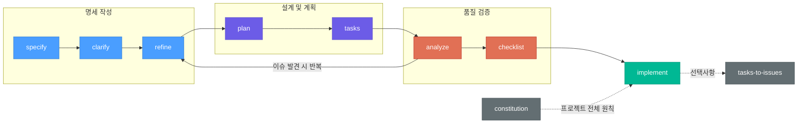

# Speckit Helper

Claude Code용 명세 기반 개발(Specification-Driven Development) 플러그인입니다.
기능 아이디어를 구조화된 명세서, 실행 가능한 작업 목록, 의존성 인식 구현으로 변환합니다.

## 빠른 시작

```bash
# 플러그인 설치
/plugin install speckit-helper@synapse-marketplace

# 1. 기능 아이디어로 명세서 생성
/speckit-helper:specify 이메일/비밀번호 로그인과 OAuth2를 지원하는 사용자 인증 추가

# 2. 기술 설계 및 작업 목록 생성
/speckit-helper:plan user-authentication
/speckit-helper:tasks user-authentication

# 3. 의존성 순서에 따라 작업 구현
/speckit-helper:implement user-authentication
```

## 워크플로우

Speckit Helper는 구조화된 명세 기반 개발(SDD) 파이프라인을 따릅니다:



각 단계는 `.speckit/` 디렉토리에 구조화된 산출물을 생성하며,
요구사항부터 구현까지의 추적성을 유지합니다.

## 명령어 레퍼런스

| 명령어 | 설명 |
|--------|------|
| `/speckit-helper:help` | 명령어, 워크플로우, 빠른 시작 가이드 표시 |
| `/speckit-helper:specify` | 자연어 설명으로 기능 명세서 생성 |
| `/speckit-helper:clarify` | 타겟 Q&A로 모호한 부분 해결 |
| `/speckit-helper:refine` | 새로운 정보 또는 변경된 요구사항으로 명세서 업데이트 |
| `/speckit-helper:constitution` | 프로젝트 전체 원칙 및 품질 기준 정의 |
| `/speckit-helper:plan` | 기술 설계 및 계획 문서 생성 |
| `/speckit-helper:tasks` | 명세서를 의존성 순서 작업 목록으로 분해 |
| `/speckit-helper:analyze` | 명세서 일관성, 갭, 품질 검사 (읽기 전용) |
| `/speckit-helper:checklist` | 도메인별 품질 체크리스트 생성 |
| `/speckit-helper:implement` | 의존성 인식 순서로 작업 실행 |
| `/speckit-helper:tasks-to-issues` | 작업을 레이블이 포함된 GitHub Issues로 변환 |

## 스킬 레퍼런스

스킬은 대화 컨텍스트와 트리거 키워드에 따라 자동으로 활성화됩니다.

| 스킬 | 트리거 키워드 |
|------|--------------|
| spec-authoring | specification, requirements, user story, acceptance criteria, feature spec |
| task-decomposition | task list, work breakdown, dependency order, T001, parallelizable |
| consistency-analysis | consistency, gap analysis, conflict detection, traceability |
| checklist-generation | checklist, quality gate, requirement testing, validation |

## 에이전트 레퍼런스

에이전트는 스킬을 조율하여 다단계 워크플로우를 오케스트레이션합니다.

| 에이전트 | 목적 |
|----------|------|
| spec-workflow | 전체 워크플로우: specify → clarify → plan → tasks → analyze → implement |
| quality-gate | 품질 검사: analyze → checklist → report → 수정 제안 |

## 생성 산출물

모든 speckit 산출물은 프로젝트 루트의 `.speckit/` 디렉토리에 저장됩니다:

```
<project-root>/
└── .speckit/
    ├── constitution.md                    # 프로젝트 전체 원칙 (공유)
    └── <feature-slug>/                    # 기능별 디렉토리
        ├── spec.md                        # 기능 명세서
        ├── research.md                    # 기술 조사 및 결정
        ├── plan.md                        # 기술 설계
        ├── data-model.md                  # 데이터 모델 정의
        ├── quickstart.md                  # 설정 및 통합 가이드
        ├── tasks.md                       # 실행 가능한 작업 목록
        ├── contracts/                     # API 계약서
        │   └── *.md
        └── checklists/                    # 품질 체크리스트
            ├── requirements.md
            ├── ux.md
            ├── api.md
            ├── security.md
            ├── performance.md
            └── data.md
```

## 설정

### Constitution (프로젝트 헌법)

모든 명세서에 적용되는 프로젝트 전체 원칙을 정의합니다:

```bash
/speckit-helper:constitution
```

다음 항목을 포함하는 대화형 Q&A로 `.speckit/constitution.md`를 생성합니다:
- 핵심 아키텍처 원칙
- 코딩 표준
- 품질 임계값
- 기술 제약사항

Constitution은 분석 및 구현 단계에서 검증됩니다.

### 출력 디렉토리

모든 생성 산출물은 기본적으로 `.speckit/`에 저장됩니다. 팀 가시성을 위해
이 디렉토리를 버전 관리에 커밋하는 것을 권장합니다.

로컬에서만 유지하려면 `.gitignore`에 추가하세요:
```
.speckit/
```

## 상세 사용 예시

### 예시 A: 새 기능을 처음부터 구현 (전체 워크플로우)

```bash
# 1단계: 명세서 생성
/speckit-helper:specify 이메일/비밀번호 로그인과 OAuth2를 지원하는 사용자 인증 추가

# Claude가 생성하는 파일:
#   .speckit/user-authentication/spec.md
#   .speckit/user-authentication/checklists/requirements.md

# 2단계: 모호한 부분 명확화
/speckit-helper:clarify user-authentication

# Claude가 최대 5개의 타겟 질문을 제시합니다:
#   "비밀번호 재설정 기능을 이 기능에 포함해야 하나요?"
#   "어떤 OAuth2 프로바이더를 지원해야 하나요? (Google, GitHub 등)"
#   ...답변을 spec.md에 반영합니다

# 3단계: 기술 설계 생성
/speckit-helper:plan user-authentication

# Claude가 생성하는 파일:
#   .speckit/user-authentication/research.md      (라이브러리 비교: Passport vs Auth.js)
#   .speckit/user-authentication/plan.md           (아키텍처, 컴포넌트 설계)
#   .speckit/user-authentication/data-model.md     (User, Session, OAuthToken 스키마)
#   .speckit/user-authentication/quickstart.md     (설정 안내)

# 4단계: 작업으로 분해
/speckit-helper:tasks user-authentication

# Claude가 .speckit/user-authentication/tasks.md를 생성합니다:
#   ## Phase 1: Setup
#   - [ ] T001 [P] src/config/auth.ts — 인증 미들웨어 설정 [Spec §2.1]
#   - [ ] T002 [P] src/models/user.ts — 비밀번호 해시가 포함된 User 모델 생성 [Spec §3.1]
#
#   ## Phase 2: Foundation
#   - [ ] T003 src/services/auth.ts — 이메일/비밀번호 로그인 서비스 구현 [Spec §2.2]
#   - [ ] T004 src/services/oauth.ts — OAuth2 프로바이더 연동 구현 [Spec §2.3]
#   ...

# 5단계: 품질 검사
/speckit-helper:analyze user-authentication

# Claude가 보고합니다 (읽기 전용):
#   [HIGH] FR-003 "rate limiting"에 대응하는 작업이 없음
#   [MEDIUM] T004가 OAuth를 참조하지만 spec §2.3에는 Google만 명시됨
#   ...

# 6단계: 체크리스트 생성
/speckit-helper:checklist user-authentication --domain security

# Claude가 .speckit/user-authentication/checklists/security.md를 생성합니다:
#   - [ ] 비밀번호가 bcrypt/argon2로 해시되는가? [Spec §3.1]
#   - [ ] 로그인 엔드포인트에 무차별 대입 방지가 있는가? [Spec §2.2]
#   ...

# 7단계: 구현
/speckit-helper:implement user-authentication

# Claude가 의존성 순서대로 작업을 구현하며, 각각 [X]로 완료 표시합니다
```

### 예시 B: 기존 명세서 개선

```bash
# 새로운 요구사항으로 명세서 업데이트
/speckit-helper:refine user-authentication TOTP 기반 2단계 인증 추가

# Claude가 spec.md에 새 FR 항목을 추가하고 plan.md/tasks.md를 최신이 아님으로 표시합니다

# 업데이트된 명세서로 계획 재실행
/speckit-helper:plan user-authentication

# 작업 재생성
/speckit-helper:tasks user-authentication
```

### 예시 C: 프로젝트 Constitution 설정

```bash
# 프로젝트 전체 원칙 정의
/speckit-helper:constitution

# Claude가 대화형 질문을 제시합니다:
#   "핵심 아키텍처 원칙은 무엇인가요?"
#   "이 프로젝트가 따르는 코딩 표준은 무엇인가요?"
#   "타협할 수 없는 품질 임계값은 무엇인가요?"
#
# 버전이 지정된 원칙으로 .speckit/constitution.md를 생성합니다:
#   ## Core Principles (v1.0.0)
#   1. 모든 API 엔드포인트는 OpenAPI 문서가 있어야 함
#   2. 리포지토리 레이어 외부에서 직접 DB 쿼리 금지
#   3. 새 기능의 최소 80% 테스트 커버리지
```

### 예시 D: 작업에서 GitHub Issues 생성

```bash
# 생성될 내용 미리보기
/speckit-helper:tasks-to-issues user-authentication --dry-run

# Claude가 출력합니다:
#   12개의 Issue를 생성합니다:
#     Issue: "T001 - 인증 미들웨어 설정" [phase:setup, size:S]
#     Issue: "T002 - 비밀번호 해시가 포함된 User 모델 생성" [phase:setup, size:M]
#     ...
#   마일스톤 생성: "user-authentication"

# 실제 실행
/speckit-helper:tasks-to-issues user-authentication

# Claude가 GitHub Issues를 생성하고 tasks.md를 업데이트합니다:
#   - [X] T001 (#42) [P] src/config/auth.ts — 인증 미들웨어 설정
#   - [X] T002 (#43) [P] src/models/user.ts — 비밀번호 해시가 포함된 User 모델 생성
```

### 예시 E: 특정 작업 또는 페이즈 구현

```bash
# 단일 작업 구현
/speckit-helper:implement user-authentication --task T003

# 페이즈 전체 작업 구현
/speckit-helper:implement user-authentication --phase foundation
```

### 예시 F: 도움말 사용

```bash
# 처음 사용하는 경우
/speckit-helper:help

# Claude가 출력합니다:
#   Speckit Helper — 명세 기반 개발
#
#   워크플로우:  specify → clarify → refine → plan → tasks → analyze → checklist → implement
#
#   | 명령어                | 설명                                           |
#   |----------------------|------------------------------------------------|
#   | /speckit-helper:specify      | 설명으로 기능 명세서 생성             |
#   | /speckit-helper:clarify      | Q&A로 모호한 부분 해결               |
#   | /speckit-helper:refine       | 새로운 정보로 명세서 업데이트          |
#   | ...                          | ...                                  |
#
#   빠른 시작:
#     1. /speckit-helper:specify <기능 아이디어>
#     2. /speckit-helper:plan
#     3. /speckit-helper:tasks
#     4. /speckit-helper:implement
```

## 문제 해결

### "No specifications found"

`.speckit/` 디렉토리가 없거나 기능 하위 디렉토리가 없다는 의미입니다.
`/speckit-helper:specify <기능 설명>`을 실행하여 첫 번째 명세서를 생성하세요.

### "tasks.md not found"

implement 명령어는 작업 목록이 필요합니다. 먼저 다음 명령어를 실행하세요:
1. `/speckit-helper:plan <feature-slug>`
2. `/speckit-helper:tasks <feature-slug>`

### "Quality gate: FAIL"

CRITICAL 발견 사항은 구현 전에 해결해야 합니다. 분석 보고서에 구체적인
수정 제안이 포함되어 있습니다. `/speckit-helper:refine <slug> <수정 내용>`으로
각 문제를 해결한 후 `/speckit-helper:analyze <slug>`를 다시 실행하세요.

### "spec.md is stale"

`/speckit-helper:refine` 실행 후 종속 문서(plan.md, tasks.md)가 최신이 아닌 것으로
표시될 수 있습니다. 계획 파이프라인을 다시 실행하세요:
1. `/speckit-helper:plan <feature-slug>`
2. `/speckit-helper:tasks <feature-slug>`

### "GitHub CLI not found"

`/speckit-helper:tasks-to-issues` 명령어는 GitHub CLI(`gh`)가 필요합니다.
https://cli.github.com/ 에서 설치하고 `gh auth login`으로 인증하세요.

### 모든 프로젝트 타입에서 작동

Speckit Helper는 프로젝트 파일(package.json, pyproject.toml, go.mod, Cargo.toml 등)에서
기술 스택을 자동 감지하고 생성되는 명세서를 그에 맞게 조정합니다.
외부 의존성이나 도구가 필요하지 않습니다.

## 라이선스

이 플러그인은 **datamaker-kr Restricted Use License**로 라이선스됩니다.
전체 조건은 [LICENSE](LICENSE)를 참조하세요.

Copyright (c) 2026 datamaker-kr Organization. All Rights Reserved.
